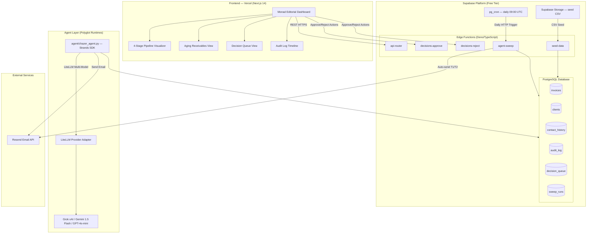

# 02 — System Architecture

> **Chazer** · Autonomous Invoice-Chasing Agent

---

## 1. High-Level System Architecture (Polyglot Design)

```
┌─────────────────────────────────────────────────────────────────────────────┐
│                          CHAZER SYSTEM OVERVIEW                             │
│                                                                             │
│  ┌──────────────────────────────┐         ┌────────────────────────────┐   │
│  │     FRONTEND (Vercel)        │         │  BACKGROUND AGENT LOOP     │   │
│  │                              │         │  (Dual-Runtime Polyglot)   │   │
│  │  Next.js + Tailwind CSS      │         │                            │   │
│  │  Monad Editorial Dashboard   │         │  pg_cron → daily 09:00 UTC │   │
│  │  ┌──────────────────────┐   │         │  ┌──────────────────────┐  │   │
│  │  │ 4-Stage Visualizer   │   │         │  │ 1. agent-sweep (TS)  │  │   │
│  │  │ Aging Receivables    │   │         │  │ (Deno Edge Function) │  │   │
│  │  │ Decision Queue       │   │         │  └─────────┬────────────┘  │   │
│  │  │ Audit Log Timeline   │   │         │            │                │   │
│  │  └──────────────────────┘   │         │  ┌─────────▼────────────┐  │   │
│  │                             │         │  │ 2. strands-agent.py  │  │   │
│  │                             │         │  │ (Python Strands SDK) │  │   │
│  └──────────┬───────────────────┘         │  └─────────┬────────────┘  │   │
│             │ REST (HTTPS)                │            │ Multi-Model   │   │
│             ▼                             │            ▼ LiteLLM       │   │
│  ┌──────────────────────────────┐         │  ┌──────────────────────┐  │   │
│  │  SUPABASE EDGE FUNCTIONS     │         │  │ Grok / Gemini /      │  │   │
│  │  (REST API Layer)            │         │  │ OpenAI GPT-4o-mini   │  │   │
│  │                              │         │  └──────────────────────┘  │   │
│  │  GET  /functions/v1/invoices │         └────────────────────────────┘   │
│  │  GET  /functions/v1/decisions│                      │                   │
│  │  POST /functions/v1/decisions│                      │                   │
│  │  GET  /functions/v1/audit    │                      │                   │
│  │  POST /functions/v1/sweep    │                      │                   │
│  └──────────┬───────────────────┘                      │                   │
│             │                                          │                   │
│             ▼                                          ▼                   │
│  ┌─────────────────────────────────────────────────────────────────────┐   │
│  │                     SUPABASE (Free Tier)                            │   │
│  │  ┌──────────────┐  ┌────────────────┐  ┌──────────────────────┐   │   │
│  │  │  PostgreSQL  │  │ Supabase       │  │  Supabase Storage    │   │   │
│  │  │  Database    │  │ Edge Functions │  │  (seed CSV file)     │   │   │
│  │  │              │  │                │  └──────────────────────┘   │   │
│  │  │  invoices    │  │  pg_cron       │                              │   │
│  │  │  clients     │  │  (scheduler)   │                              │   │
│  │  │  contact_    │  │                │                              │   │
│  │  │  history     │  └────────────────┘                              │   │
│  │  │  audit_log   │                                                   │   │
│  │  │  decision_   │                                                   │   │
│  │  │  queue       │                                                   │   │
│  │  │  sweep_runs  │                                                   │   │
│  │  └──────────────┘                                                   │   │
│  └─────────────────────────────────────────────────────────────────────┘   │
│                                    │                                        │
│                                    ▼                                        │
│                        ┌──────────────────────┐                            │
│                        │  Resend Email API     │                            │
│                        │  (100 free/day)       │                            │
│                        │  Sandbox mode for demo│                            │
│                        └──────────────────────┘                            │
└─────────────────────────────────────────────────────────────────────────────┘
```

---

## 2. Mermaid Diagram



---

## 3. Data Flow & Execution Pipeline

### 3A. Daily Background Sweep (Autonomous Loop)

```
Step 1 — Scheduler
  pg_cron fires at 09:00 UTC
  → Inserts a job record into cron.job_run_details
  → HTTP POSTs to https://<project>.supabase.co/functions/v1/agent-sweep

Step 2 — Edge Function Bootstrap (agent-sweep.ts)
  → Validates internal cron secret header
  → Opens Supabase service-role DB connection
  → Queries: SELECT all invoices WHERE status IN ('SENT','OVERDUE')
             AND last_contact_at < NOW() - INTERVAL '72 hours'
             OR last_contact_at IS NULL

Step 3 — Invoice Classification (per invoice)
  → Compute days_overdue = CURRENT_DATE - due_date
  → Determine tier:
    if days_overdue 1-7 AND contact_count = 0 → TIER_1
    if days_overdue 8-21 AND contact_count >= 1 → TIER_2
    if days_overdue >= 22 OR dispute_flag = true → TIER_3
    if amount >= owner.high_value_threshold → ESCALATE_REGARDLESS

Step 4 — LLM Call (Strands Agent / Gemini)
  → Construct prompt with invoice context, client name, amount, days overdue, prior contact summary
  → POST to Gemini 1.5 Flash via Strands LiteLLM provider
  → Receive: { email_subject, email_body, classification_reason, confidence_score }
  → Validate output: contains invoice_id, no profanity, length < 500 words

Step 5 — Action Dispatch
  IF tier = TIER_1 or TIER_2:
    → Write audit_log record (PENDING)
    → POST to Resend API
    → On success: write contact_history; update invoice.last_contact_at; 
                  update audit_log status to SENT
    → On failure: update audit_log status to FAILED; do not retry same run

  IF tier = TIER_3 or ESCALATE:
    → Write decision_queue record with AI draft content
    → Write audit_log record (ESCALATED)
    → Do NOT call Resend

Step 6 — Sweep Summary
  → Write sweep_run record with: invoices_processed, sent_count, escalated_count, failed_count, duration_ms
  → Edge Function returns 200 OK
```

### 3B. Owner Action Flow (Dashboard → DB → Email)

```
User clicks "Approve" on Decision Queue item
  → POST /functions/v1/decisions/:id/approve
  → Edge Function validates: decision.status = 'PENDING_APPROVAL'
  → POST to Resend with decision.draft_subject + decision.draft_body
  → On success:
      UPDATE decision_queue SET status='APPROVED', resolved_at=NOW()
      UPDATE invoices SET status='FINAL_NOTICE_SENT'
      INSERT INTO audit_log (action='OWNER_APPROVED', ...)
  → Return 200 { sent: true }
```

### 3C. CSV Seed Flow (One-Time Initialisation)

```
1. Admin uploads seed.csv to Supabase Storage bucket: "seed-data"
2. Admin calls POST /functions/v1/seed-data (with secret header)
3. Edge Function downloads CSV from Storage
4. Parses rows: invoice_id, client_name, client_email, amount, due_date, status
5. Upserts into: clients, invoices (idempotent on invoice_id)
6. Returns: { seeded: N, skipped: M }
```

---

## 4. Subsystem Breakdown

### 4.1 Frontend (Next.js on Vercel)

| Module | File(s) | Responsibility |
|--------|---------|----------------|
| Dashboard Shell | `app/layout.tsx`, `app/page.tsx` | Navigation, layout, global state provider |
| Aging View | `app/invoices/page.tsx` | Fetch + render invoice table sorted by days overdue |
| Decision Queue | `app/decisions/page.tsx` | Render pending decisions; Approve/Reject actions |
| Audit Log | `app/audit/page.tsx` | Paginated timeline of agent actions |
| API Client | `lib/api.ts` | Typed fetch wrapper for all Supabase Edge Function calls |
| State | `lib/store.ts` (Zustand) | Client-side cache of invoices, decisions, audit entries |

### 4.2 Supabase Edge Functions (Deno/TypeScript)

| Function | Trigger | Responsibility |
|----------|---------|----------------|
| `api-router` | HTTP (from dashboard) | Routes CRUD requests for invoices, decisions, audit log |
| `agent-sweep` | pg_cron (daily) + HTTP (manual trigger) | Orchestrates the agent loop; calls strands-agent |
| `seed-data` | HTTP (one-time admin call) | Parses CSV from Storage; upserts demo data |
| `decisions-approve` | HTTP POST | Validates approval; calls Resend; updates DB |
| `decisions-reject` | HTTP POST | Rejects decision; updates DB |

### 4.3 Strands Agent (Python)

| Module | Responsibility |
|--------|---------------|
| `agent/chazer_agent.py` | Main Strands `Agent` definition with tools registered |
| `agent/tools/classify.py` | Tool: classify invoice → tier + escalation reason |
| `agent/tools/draft_email.py` | Tool: generate email draft from invoice context |
| `agent/tools/db_client.py` | Tool: read/write Supabase Postgres via supabase-py |
| `agent/tools/send_email.py` | Tool: call Resend API |
| `agent/main.py` | CLI entry point; accepts `--invoice-ids` list |

### 4.4 Database (Supabase Postgres)

| Table | Purpose |
|-------|---------|
| `clients` | Client directory |
| `invoices` | Invoice records with status and tier |
| `contact_history` | Every email sent per invoice |
| `audit_log` | Immutable log of every agent action |
| `decision_queue` | Pending human decisions with AI draft |
| `sweep_runs` | Metadata for each agent sweep |

---

## 5. Asynchronous vs. Synchronous Workloads

### Synchronous (request-response < 5s)

- All dashboard REST API calls (GET invoices, GET decisions, GET audit log)
- Owner approve/reject actions
- Manual sweep trigger (returns immediately; sweep runs async via `EdgeRuntime.waitUntil`)

### Asynchronous (background, decoupled)

| Workload | Trigger | Pattern | Max Duration |
|----------|---------|---------|-------------|
| Daily agent sweep | pg_cron 09:00 UTC | Fire-and-forget HTTP POST to Edge Function | 30s (Edge Function limit: 150s) |
| Strands agent processing | Invoked by Edge Function | Sub-process or HTTP to Python endpoint | ~20s for 50 invoices |
| Resend email delivery | Called within sweep | HTTP POST, response awaited | 5s timeout |
| CSV seed | Admin HTTP call | Synchronous parse + upsert | < 10s for 100-row CSV |

### Idempotency Design

Each sweep checks `last_contact_at` before sending. The `contact_window_hours` guard (default 72h) prevents re-sending within any given window, making the sweep safe to re-trigger manually during demo.

---

## 6. Deployment Topology

```
Internet
    │
    ├── Vercel CDN (Next.js static + SSR)
    │       └── app.chazer.dev  (example)
    │
    └── Supabase Platform
            ├── PostgreSQL DB (region: us-east-1)
            ├── Edge Functions (globally distributed Deno)
            │     └── invoked at: <project>.supabase.co/functions/v1/*
            └── Storage (bucket: seed-data)
```

**No servers to manage.** All compute is serverless and pay-per-use (both platforms are free tier for this scale).
