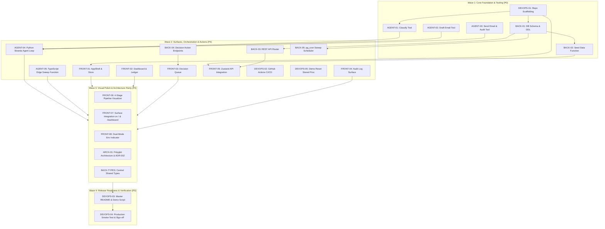

# 23 — Parallel Execution Plan & Wave Roadmap

> **Chazer** · 21 Granular Tickets · Polyglot Autonomous Accounts Receivable Agent

---

## 🗺 Dependency & Wave Graph



---

## 📊 Parallel Execution Status Matrix (21/21 Completed · 100%)

### Workstream A: Backend & Supabase Edge Functions
- `BACK-01` (Initial Supabase database schema & DDL): 🟢 **Completed**
- `BACK-02` (Seed-data Edge Function & CSV pipeline): 🟢 **Completed**
- `BACK-03` (REST API Router Edge Function): 🟢 **Completed**
- `BACK-04` (Decisions-approve & decisions-reject Edge Functions): 🟢 **Completed**
- `BACK-05` (pg_cron daily autonomous sweep schedule): 🟢 **Completed**
- `BACK-TYPES` (Centralized shared types & interfaces): 🟢 **Completed**

### Workstream B: AI & Strands Agent Engine
- `AGENT-01` (classify_invoice Strands tool): 🟢 **Completed**
- `AGENT-02` (draft_email Strands tool with LiteLLM): 🟢 **Completed**
- `AGENT-03` (send_email & write_audit_log tools): 🟢 **Completed**
- `AGENT-04` (ChazerCollectionAgent Python CLI sweep loop): 🟢 **Completed**
- `AGENT-05` (agent-sweep TypeScript Edge Function): 🟢 **Completed**

### Workstream C: Next.js Frontend Dashboard (Monad Editorial)
- `FRONT-01` (AppShell, Sidebar, TopBar & Zustand Store): 🟢 **Completed**
- `FRONT-02` (Dashboard page & Aging Receivables Table): 🟢 **Completed**
- `FRONT-03` (Decision Queue page with AI draft modal): 🟢 **Completed**
- `FRONT-04` (Audit Log execution journal & timeline): 🟢 **Completed**
- `FRONT-05` (Zustand client store & Edge API wiring): 🟢 **Completed**
- `FRONT-06` (4-Stage Connected Pipeline Visualizer Component): 🟢 **Completed**
- `FRONT-07` (Surface integration of visualizer on `/` and `/dashboard`): 🟢 **Completed**
- `FRONT-08` (Dual-Mode Environment Indicator in TopBar): 🟢 **Completed**

### Workstream D: DevOps, Architecture & Documentation
- `DEVOPS-01` (Repository scaffolding & tooling): 🟢 **Completed**
- `DEVOPS-02` (GitHub Actions CI/CD pipeline): 🟢 **Completed**
- `DEVOPS-05` (Demo reset stored procedure `reset_demo()`): 🟢 **Completed**
- `ARCH-01` (Polyglot Architecture formalization & ADR-002): 🟢 **Completed**
- `DEVOPS-03` (Master README & 3-Minute Demo Script alignment): 🟢 **Completed**
- `DEVOPS-04` (Production smoke-test & submission verification): 🟢 **Completed**

---

## 🧪 Verification Commands

```bash
# Frontend & Edge Function Vitest Suites (129 tests across 12 files)
cd dashboard && npm test

# TypeScript typecheck
cd dashboard && npx tsc --noEmit

# Python Agent Pytest Suite (42 tests)
pytest agent/tests/ -v

# Python Agent CLI Sweep (Sandbox mode)
python -m agent.main --sandbox
```
